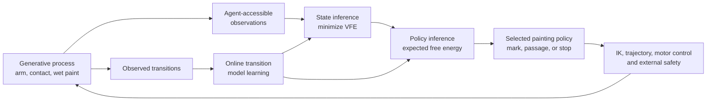

# Active-Inference Painter

[](https://github.com/jacksonhill126/Active-Inference-Painter/actions/workflows/ci.yml)

An embodied active-inference research project built around a simulated robotic
abstract painter.

The project asks whether a physically situated agent can develop temporally
extended spatial organization through perception, prediction, action, and
belief revision without reference images, aesthetic rewards, demonstrated
painting policies, or fine-tuning on a painting corpus.

> **Status:** M1 formal-baseline research prototype. Paint material remains in the custom
> Python process; realized arm dynamics and contact can use either the native
> reference plant or the hardware-oriented MuJoCo model. It is not validated
> for physical hardware, its default sensor path remains fail-closed, and its
> present visual output should not be treated as evidence of learned
> composition.

## Quick Start

Requires Python 3.11 or newer.

```bash
python -m venv .venv
# Windows: .venv\Scripts\activate
# macOS/Linux: source .venv/bin/activate
python -m pip install -e ".[dev]"
python -m active_painter.web_server
```

Open `http://127.0.0.1:8017`.

The live default is deliberately fail-closed: the viewer runs, but active
policy inference remains disabled until the fixed-camera/body likelihood and
sensor-conditioned posterior are implemented. This prevents the model from
silently receiving exact pose, contact, canvas material, or copied simulator
state.

The former hidden-state baseline is retained only as an explicitly labelled
diagnostic comparator:

```bash
python -m active_painter.web_server --observation-mode oracle_material_state
```

That mode is not sensor-equivalent and must not support physical-agent claims.

To use MuJoCo for realized arm dynamics, RobStride-equivalent electrical
current/back-EMF and actuator limits, brush compliance, and contact while
retaining the Python paint-material process:

```bash
python -m pip install -e ".[dev,mujoco]"
python -m active_painter.web_server --plant-backend mujoco
```

Run the deterministic smoke suite:

```bash
python -m pytest -q \
  tests/test_action_encoding.py \
  tests/test_canvas.py \
  tests/test_motion_manifold.py \
  tests/test_motor_reliability.py \
  tests/test_modality_units.py \
  tests/test_native_contract.py \
  tests/test_observation_factorization.py \
  tests/test_plant_interface.py \
  tests/test_precision_beliefs.py \
  tests/test_preferences.py \
  tests/test_proposal.py \
  tests/test_proposal_convergence.py \
  tests/test_reference_oracle.py \
  tests/test_sensor_access_contract.py \
  tests/test_spatial_state.py \
  tests/test_stop_policy.py \
  tests/test_stop_prior.py
```

PowerShell accepts the same file list on one line. The complete suite is
`python -m pytest -q`; it currently includes expensive and timing-sensitive
integration tests. The latest observed results and environmental caveats are
recorded in [`docs/PROGRESS.md`](docs/PROGRESS.md).

## System Overview



Painting decisions are intended to remain inside an explicit probabilistic
model. Conventional inverse kinematics, trajectory generation, motor control,
collision checks, and hard safety constraints realize or veto a selected
policy below that boundary.

## Plant And Motor Terminology

Four related terms refer to different decisions and models:

| Term | Current meaning |
| --- | --- |
| Hardware actuator assignment | Fixed in the current hardware-oriented draft: RobStride 03 for `yaw`/`pitch`, RobStride 02 for `roll`/`elbow`. It is not selected dynamically. |
| Native plant | `native-abstract-v0` / `JointPlant`, a representative model not identified from those motors. |
| MuJoCo plant | `mujoco-robstride-electromechanical-v4`, a selectable vendor-grounded realized-execution backend, not yet a calibrated hardware twin. |
| Motor realization | An inferred controller/trajectory latent; it chooses how to realize a painting policy, not which motor product is installed. |

Counterfactual motor forecasts preserve the selected plant: native execution
uses native forecasts, while MuJoCo execution uses independent MuJoCo rollout
data under the same immutable model. Forecast initialization still deep-copies
exact process state, so forecast-driven policy inference remains confined to
the explicit `baseline-oracle-v0` diagnostic until the body posterior is
connected. MuJoCo parameter uncertainty is not yet sampled. See the canonical
[model record](models/README.md), the [native reference](docs/NATIVE_PLANT_REFERENCE.md),
and the [control/plant/policy boundary](docs/CONTROL_PLANT_POLICY_BOUNDARY.md).

## Implemented Prototype

- Stochastic four-degree-of-freedom arm, encoder, actuator, compliance, and
  contact simulation.
- Persistent wet oil-paint material state with thickness, pigment, surface
  tone, and material coverage.
- Sparse pixel-local learned transition ensembles with aleatoric and ensemble
  uncertainty.
- Variational state inference and separately logged VFE diagnostics.
- EFE-based policy inference with an immediate-stop policy and terminal
  material-coverage preference.
- Hierarchical mark, polyline, passage, and passage-plan proposals.
- An in-progress amortized mark/passage proposal network conditioned on canvas
  and relational beliefs. Its emission mixture defaults to zero; a dedicated
  unit suite covers density normalization/support, sampler parity, training,
  checkpoint continuation, and separation from EFE. The proposal-budget audit
  found that posterior mass and deep-horizon winning geometry do not converge
  under the tested budgets, so the result is explicitly conditional on the
  sampled candidate set. It is not a policy prior or a correction for
  finite-candidate bias.
- Registered global/requested-foveal camera observations, a provisional camera
  likelihood, and isolated compact body/brush posterior components. These are
  not yet connected into a complete sensor-only painting loop.
- Motor-realization forecasts over Cartesian, joint-space, elbow-pivot, and
  upper-arm-roll alternatives.
- Checkpointing, replay, telemetry export, and a Python-backed Three.js viewer
  that builds its robot hierarchy from the MuJoCo XML while retaining the
  Python material-canvas display.
- Selectable native and MuJoCo realized-execution backends behind the SI-unit
  plant contract. The MuJoCo backend uses output-equivalent RobStride dcmotors
  with voltage, current-lag, back-EMF, and peak-torque saturation. MuJoCo motor
  forecasts now use independent instances of that same plant, with explicit
  exact-state-oracle initialization and approximation provenance.
- Broad deterministic and integration test coverage across material,
  inference, hierarchy, arm, execution, and runtime behavior.

Several higher-level elements remain provisional. The sensor-equivalent path
fails closed before painting policy inference; the explicit oracle comparator
uses simulator information unavailable to a physical robot. Global and
relational latents are not yet validated as predictively necessary, policy
inference is proposal-limited, and the custom mechanical model has not been
calibrated against hardware.

## Research Discipline

The governing constraint is that painting-level decision terms must be
identifiable as likelihoods, transition priors, prior preferences, precision
beliefs, VFE/EFE terms, or policy priors/posteriors. Approximations are named as
approximations. Ordinary rewards are not relabeled as active inference.

The project deliberately separates:

- hidden generative-process truth;
- observations physically available to the agent;
- prior and posterior beliefs;
- predicted policy consequences;
- controller targets and realized motion;
- evaluation-only measurements.

That separation is incomplete in the current prototype and is a central target
of M1-M3.

## Roadmap

The work is organized as a research spine and a supporting embodiment spine:

| Sequence | Purpose |
| --- | --- |
| M0 | Project operations, manifests, versions, failures, and validation gates |
| M1 | Formal baseline, sensor-access audit, VFE/EFE verification, calibration |
| M2 | Sensor-equivalent multiscale perception and uncertain latent state |
| M3 | Foveated hierarchical policy inference and mechanism ablations |
| S0-S2 | Native reference contract, MuJoCo clone, and backend adapter |
| M4-M8 | Observatory, geometry, CAD, hardware bring-up, and experiments |

See [`planning/MILESTONE_INDEX.md`](planning/MILESTONE_INDEX.md) for status and
dependencies. Milestones are capability-gated rather than treated as a promise
that every planned feature will be built.

## Documentation

- [`docs/PROGRESS.md`](docs/PROGRESS.md): current evidence, known failures, and public progress log.
- [`docs/BASELINE_TEST_RESULT_2026-07-24.md`](docs/BASELINE_TEST_RESULT_2026-07-24.md): latest complete-suite environment and result.
- [`docs/RESEARCH_CHARTER.md`](docs/RESEARCH_CHARTER.md): scientific intent and scope.
- [`docs/ARCHITECTURE.md`](docs/ARCHITECTURE.md): long-form architecture brief.
- [`docs/GENERATIVE_MODEL_SPEC.md`](docs/GENERATIVE_MODEL_SPEC.md): implemented probabilistic factorization, VFE/EFE map, and approximation register.
- [`docs/PROPOSAL_CONVERGENCE_RESULT_2026-08-04.md`](docs/PROPOSAL_CONVERGENCE_RESULT_2026-08-04.md): AI-111 candidate-budget, horizon, seed, and mixture result.
- [`docs/OBSERVATION_FACTOR_AUDIT.md`](docs/OBSERVATION_FACTOR_AUDIT.md): independent material factors, units, normalization, and provisional likelihoods.
- [`docs/NATIVE_PLANT_REFERENCE.md`](docs/NATIVE_PLANT_REFERENCE.md): versioned native arm, canvas, contact, and material contract.
- [`docs/CONTROL_PLANT_POLICY_BOUNDARY.md`](docs/CONTROL_PLANT_POLICY_BOUNDARY.md): backend-neutral command, sensor, belief, forecast, and evaluation interfaces.
- [`docs/VARIABLE_SENSOR_ACCESS_LEDGER.md`](docs/VARIABLE_SENSOR_ACCESS_LEDGER.md): simulator-to-agent values, physical accessibility, and research blockers.
- [`docs/CURRENT_IMPLEMENTATION.md`](docs/CURRENT_IMPLEMENTATION.md): detailed prototype implementation notes.
- [`docs/DEVELOPMENT_AUDIT.md`](docs/DEVELOPMENT_AUDIT.md): historical engineering audit.
- [`planning/README.md`](planning/README.md): milestone planning system.

## Reproducibility And Safety

The project is developing version and experiment manifests for code,
configuration, learned state, simulator, calibration, hardware, random seeds,
and output artifacts. Failed and interrupted runs are retained as evidence.

Hard joint, current, force, workspace, watchdog, and non-finite-state limits
remain external to painting-policy inference. The present simulator is not a
safety case for a physical robot.
