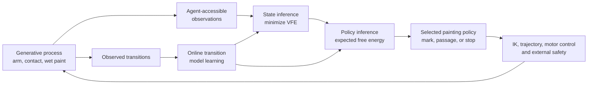

# Active-Inference Painter

[](https://github.com/jacksonhill126/Active-Inference-Painter/actions/workflows/ci.yml)

An embodied active-inference research project built around a simulated robotic
abstract painter.

The project asks whether a physically situated agent can develop temporally
extended spatial organization through perception, prediction, action, and
belief revision without reference images, aesthetic rewards, demonstrated
painting policies, or fine-tuning on a painting corpus.

> **Status:** early research prototype. The current system runs in a custom
> Python simulator and web viewer. It is not validated for physical hardware,
> and its present visual output should not be treated as evidence of learned
> composition.

## Quick Start

Requires Python 3.11 or newer.

```bash
python -m venv .venv
# Windows: .venv\Scripts\activate
# macOS/Linux: source .venv/bin/activate
python -m pip install -e ".[dev]"
python -m active_painter.web_server
```

Open `http://127.0.0.1:8017`.

Run the deterministic smoke suite:

```bash
python -m pytest -q \
  tests/test_action_encoding.py \
  tests/test_canvas.py \
  tests/test_motor_reliability.py \
  tests/test_preferences.py \
  tests/test_spatial_state.py \
  tests/test_stop_policy.py \
  tests/test_stop_prior.py
```

PowerShell accepts the same file list on one line. The complete suite is
`python -m pytest -q`; it currently includes expensive integration tests and a
known planning-timeout failure documented in
[`docs/PROGRESS.md`](docs/PROGRESS.md).

## System Overview



Painting decisions are intended to remain inside an explicit probabilistic
model. Conventional inverse kinematics, trajectory generation, motor control,
collision checks, and hard safety constraints realize or veto a selected
policy below that boundary.

## Implemented Prototype

- Stochastic four-degree-of-freedom arm, encoder, actuator, compliance, and
  contact simulation.
- Persistent wet oil-paint material state with thickness, pigment, surface
  tone, and material coverage.
- Sparse pixel-local learned transition ensembles with aleatoric and ensemble
  uncertainty.
- Variational state inference and separately logged VFE diagnostics.
- EFE-based policy inference with an immediate-stop policy and terminal
  material-coverage preference.
- Hierarchical mark, polyline, passage, and passage-plan proposals.
- Motor-realization forecasts over Cartesian, joint-space, elbow-pivot, and
  upper-arm-roll alternatives.
- Checkpointing, replay, telemetry export, and a Python-backed Three.js viewer.
- Broad deterministic and integration test coverage across material,
  inference, hierarchy, arm, execution, and runtime behavior.

Several higher-level elements remain provisional. The current observation path
uses simulator information unavailable to a physical robot, global and
relational latents are not yet validated as predictively necessary, policy
inference is proposal-limited, and the custom mechanical model has not been
calibrated against hardware.

## Research Discipline

The governing constraint is that painting-level decision terms must be
identifiable as likelihoods, transition priors, prior preferences, precision
beliefs, VFE/EFE terms, or policy priors/posteriors. Approximations are named as
approximations. Ordinary rewards are not relabeled as active inference.

The project deliberately separates:

- hidden generative-process truth;
- observations physically available to the agent;
- prior and posterior beliefs;
- predicted policy consequences;
- controller targets and realized motion;
- evaluation-only measurements.

That separation is incomplete in the current prototype and is a central target
of M1-M3.

## Roadmap

The work is organized as a research spine and a supporting embodiment spine:

| Sequence | Purpose |
| --- | --- |
| M0 | Project operations, manifests, versions, failures, and validation gates |
| M1 | Formal baseline, sensor-access audit, VFE/EFE verification, calibration |
| M2 | Sensor-equivalent multiscale perception and uncertain latent state |
| M3 | Foveated hierarchical policy inference and mechanism ablations |
| S0-S2 | Native reference contract, MuJoCo clone, and backend adapter |
| M4-M8 | Observatory, geometry, CAD, hardware bring-up, and experiments |

See [`planning/MILESTONE_INDEX.md`](planning/MILESTONE_INDEX.md) for status and
dependencies. Milestones are capability-gated rather than treated as a promise
that every planned feature will be built.

## Documentation

- [`docs/PROGRESS.md`](docs/PROGRESS.md): current evidence, known failures, and public progress log.
- [`docs/RESEARCH_CHARTER.md`](docs/RESEARCH_CHARTER.md): scientific intent and scope.
- [`docs/ARCHITECTURE.md`](docs/ARCHITECTURE.md): long-form architecture brief.
- [`docs/CURRENT_IMPLEMENTATION.md`](docs/CURRENT_IMPLEMENTATION.md): detailed prototype implementation notes.
- [`docs/DEVELOPMENT_AUDIT.md`](docs/DEVELOPMENT_AUDIT.md): historical engineering audit.
- [`planning/README.md`](planning/README.md): milestone planning system.

## Reproducibility And Safety

The project is developing version and experiment manifests for code,
configuration, learned state, simulator, calibration, hardware, random seeds,
and output artifacts. Failed and interrupted runs are retained as evidence.

Hard joint, current, force, workspace, watchdog, and non-finite-state limits
remain external to painting-policy inference. The present simulator is not a
safety case for a physical robot.
