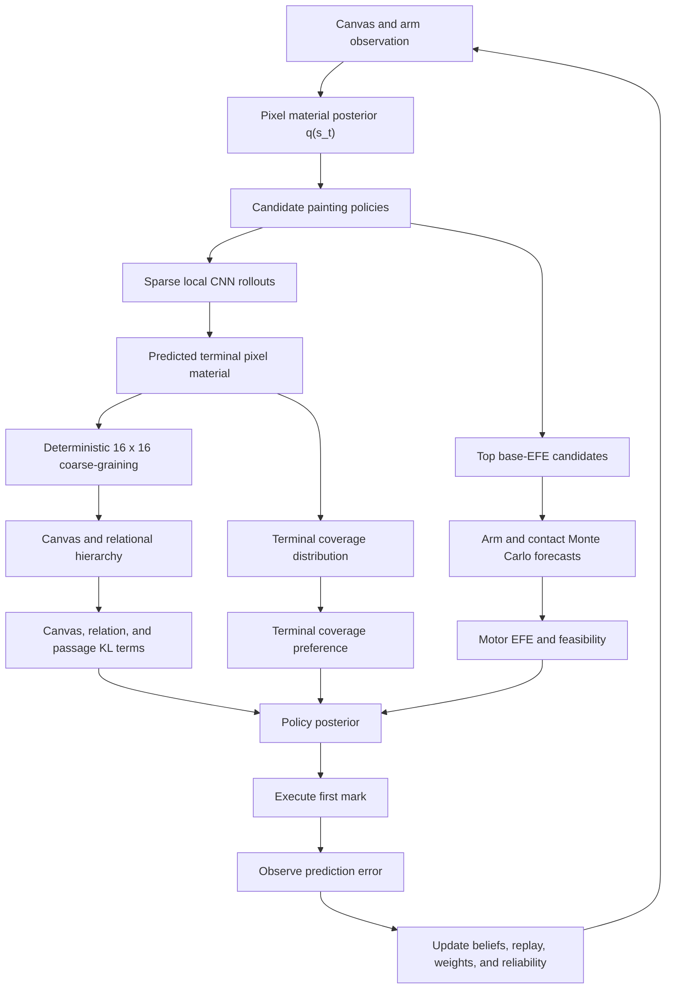

# Active-Inference Painter: Architectural Brief

This is the long-form architecture reference. It describes the research
prototype in depth and is intentionally more detailed than the root README.

Status: July 16, 2026, after commit `9e74b60`

This brief describes the project as it currently exists. It is written for a
reader who is comfortable with dynamics, controls, probability, and active
inference, but who does not necessarily know this codebase or every machine
learning term used in it.

The most important framing is this:

> The project is an online-learning active-inference painting agent wrapped
> around a stochastic arm and wet-paint simulator. It proposes marks and
> multi-mark structures, predicts their canvas and bodily consequences, scores
> those consequences using expected free energy, executes one decision at a
> time, and learns from the resulting prediction errors.

It is not yet an autonomous visual intelligence in the broad sense. It has no
subject model, object concepts, pretrained vision model, or learned vocabulary
of meaningful shapes. Its current high-level visual preference is for material
coverage and for canvases that its own hierarchy can compress better than a
flat pixel model. That is enough to produce nontrivial spatial behavior, but
not enough to guarantee coherent images.

## 1. The shortest useful mental model

The current spatial web system has roughly six layers:

1. **Physical generative process**
   A four-joint arm, compliant/noisy motors, soft canvas contact, and a
   persistent wet-oil paint simulation produce the actual next canvas.

2. **Pixel material belief**
   The agent maintains a diagonal Gaussian posterior over six material fields
   at the native canvas resolution.

3. **Local learned brush dynamics**
   A convolutional ensemble predicts how a stroke changes only the pixel patch
   around its support. Outside that patch, the transition prior is identity.

4. **Coarse canvas hierarchy**
   Pixel predictions are deterministically coarse-grained to a 16 x 16 planner
   field. Learned canvas and relational latents try to explain the larger
   structure of the predicted result.

5. **Hierarchical policies**
   Candidate policies may be individual marks, passages of related marks,
   polylines represented as connected straight segments, or plans containing
   multiple passages. Every candidate ends in `stop`.

6. **Embodied policy selection**
   The best-looking canvas candidates are refined through stochastic arm
   forecasts under several motor realizations. The final policy posterior
   includes canvas, hierarchy, and proprioceptive expected-free-energy terms.

The web renderer is not the model. Python owns the simulation, beliefs,
planning, learning, and checkpoints. Three.js displays the state returned by
the Python runtime.

## 2. A vocabulary map

Several words in this project have precise meanings.

### Generative process

The **generative process** is the world that actually generates observations.
Here, that is `ArmPainterSim`, `JointPlant`, `VerticalCanvas`, and `Brush`.

If the arm overshoots, the brush misses contact, or wet white paint picks up
black pigment, the generative process determines what physically happens.

This is analogous to the real robot and canvas in a hardware deployment.

### Generative model

The **generative model** is the agent's internal probabilistic model of what
will happen. The most important learned part is:

```text
p_theta(next material patch | current material patch, stroke, motor kind)
```

The model is deliberately not identical in form to the simulator. It is a
learned convolutional density model that must infer the simulator's behavior
from transitions.

The hierarchy adds learned distributions over slower canvas and relational
latents, and the arm forecast supplies a model of proprioceptive outcomes.

### Belief or posterior

A **belief** is a probability distribution over a hidden state. Most beliefs
in this implementation are diagonal Gaussians:

```text
q(s) = Normal(mean, diagonal variance)
```

"Diagonal" means covariance between different dimensions is not represented
explicitly. Each pixel-channel has its own variance, but the posterior does not
store a full covariance matrix between pixels.

### Variational free energy

**Variational free energy (VFE)** is used for state inference after an
observation arrives:

```text
F = KL[q(s_t) || p(s_t | s_(t-1), a_(t-1))]
    - E_q[log p(o_t | s_t)]
```

The first term is often called complexity. The second is negative expected log
likelihood. Minimizing VFE balances trust in the transition prior against trust
in the new observation.

VFE answers: "What state am I probably in now?"

### Expected free energy

**Expected free energy (EFE)** scores a future policy using predicted outcomes.
In this code, the decomposition is kept explicit rather than collapsed into a
generic scalar reward.

EFE answers: "Which policy should I infer, given what I expect it to produce?"

### Prior preference

A **prior preference** is a probability density over outcomes the agent expects
to occupy. It is not a conventional reward added after the fact.

The strongest preference in this project is a Beta density over terminal
material coverage near 0.87, conditional on the policy reaching `stop`.

### Policy prior

A **policy prior** is prior probability assigned to a policy before predicted
outcomes are considered. Examples here include:

- immediate stopping being unlikely below roughly 70 percent coverage;
- local continuation of an active passage being likely;
- the proposal mixture that supplies ordinary marks, passages, and plans;
- equal prior probability over enabled motor realization kinds.

### Precision

**Precision** is inverse variance, or more generally confidence assigned to a
modality. A high precision makes prediction error in that modality matter more
to inference. The config exposes separate precisions for terminal coverage,
observation ambiguity, transition outcomes, canvas hierarchy, relational
hierarchy, and motor outcomes.

## 3. End-to-end data flow



The agent is receding-horizon. Even when it evaluates several future marks, it
normally commits only to the first actionable decision. A structured passage
persists across several marks, but is locally re-inferred between them.

## 4. The two planner modes

There are two state representations.

### Summary mode

Summary mode is the compatibility and speed-oriented implementation. Its hidden
canvas state has six values:

1. material coverage;
2. mean thickness;
3. maximum thickness;
4. mean wetness;
5. overlap fraction;
6. mean ground contrast.

Its learned transition model is a five-member MLP ensemble with 61,500
trainable parameters in the current configuration. Each member predicts a
Gaussian next state from a 6-D state and 12-D action vector.

This mode cannot represent where paint is located. Two canvases with the same
six summaries are identical to it. It remains useful for tests, fast runs, and
comparison, but it is not the architecture to use for composition research.

### Spatial material mode

Spatial mode is the current research path and the mode used by the active web
run discussed in this project.

It maintains native pixel material, a deterministic pyramid, a 16 x 16 planner
field, learned local dynamics, and slower canvas/relational latents.

The remainder of this brief primarily describes spatial mode.

## 5. Current live web configuration

The web runtime intentionally overrides some library defaults.

| Quantity | Current web value |
|---|---:|
| Render/simulation canvas | 256 x 256 pixels |
| Physical canvas | 20 x 20 simulation units |
| Canvas plane distance | 17 simulation units |
| Physics integration | 240 Hz fixed step |
| Planner coarse grid | 16 x 16 |
| Material pyramid | 256, 64, 32, 16 |
| Material channels | 6 |
| Action raster channels | 11 |
| Candidate painting policies | 32 |
| Planning horizon | 4 marks |
| Passage candidate mixture | 0.45 |
| Passage-plan mixture | 0.15 |
| Policy precision | 0.35 |
| Motor-refined painting candidates | 2 |
| Motor kinds per refined candidate | up to 5 |
| Monte Carlo arm samples per kind | 3 |
| Spatial replay capacity | 5,000 per replay |

With the current proposal counts, a typical global candidate set contains:

- 1 immediate-stop policy;
- 12 unstructured mark policies;
- 14 passage policies;
- 5 multi-passage-plan policies.

Tone support is normally both white and black. Candidate geometry is duplicated
into matched tone alternatives when the budget permits, so color is selected
by posterior inference over consequences rather than by an unpaired final coin
flip.

## 6. Physical generative process

### 6.1 Arm kinematics

The simulated arm has four generalized coordinates:

```text
yaw, pitch, roll, elbow
```

The upper and lower links are each 13 simulation units long. The upper-arm roll
rotates the elbow hinge axis about the upper-arm axis. There is no wrist degree
of freedom.

Forward kinematics are conventional matrix rotations. Inverse kinematics fixes
upper-arm roll first, then analytically solves yaw, pitch, and elbow for a
canvas contact point.

The active-inference boundary is important:

- painting inference chooses a Cartesian stroke and a motor realization;
- IK and trajectory interpolation realize that selected policy;
- IK is not allowed to choose what should be painted.

### 6.2 Joint and motor plant

`JointPlant` is a stochastic, coupled, quasi-direct-drive-style actuator model.
Its values are representative rather than identified from a specific motor.

It includes:

- a 24 V supply and 7 A current limit;
- torque constant and winding resistance;
- separate motor and link inertias;
- pose-dependent pitch-elbow and yaw-roll inertial coupling;
- residual gravity after 98.5 percent gravity compensation;
- transmission stiffness and damping;
- viscous, Coulomb, and static friction;
- backlash deadbands;
- motor/link velocity limits;
- thermal state and current derating;
- contact-dependent load torque;
- process torque noise;
- position and velocity encoder noise.

The link masses are currently 1.35 kg for the upper arm, 0.85 kg for the lower
arm, and 0.18 kg for the brush payload. The physical link length used in
gravity calculations is 0.3302 m.

At each physics step, the plant:

1. generates noisy encoder measurements;
2. computes a servo voltage from measured position and velocity error;
3. clips voltage and current;
4. converts current to motor torque;
5. subtracts friction, contact load, Coriolis, and residual gravity;
6. solves the coupled mass matrix for acceleration;
7. integrates joint velocity and position;
8. updates compliance, backlash, thermal state, and telemetry.

This is still a compact custom model, not a full rigid-body simulator. There is
no self-collision, flexible-link mode shape, detailed gearbox model, cable
dynamics, or full contact complementarity solver.

### 6.3 Canvas contact

The canvas is a vertical plane with a 0.5-unit compliant bushing travel and
contact stiffness of 55 simulation-force units per unit deflection.

Contact pressure comes from geometric deflection plus intended pressure near
the surface. The simulator prevents increasing overtravel by rolling the arm
and plant back to the previous state.

This overtravel check is a hard engineering constraint below painting
inference. It is not represented as an aesthetic preference.

### 6.4 Wet oil paint model

The canvas stores four primary physical fields:

- thickness;
- persistent wetness;
- black pigment mass;
- optically dominant surface tone.

It derives:

- optical opacity;
- observed tone against the gray ground;
- ground contrast;
- material coverage.

Paint does not dry during a painting. Wetness is persistent. The brush is
reloaded at every pen-down from the stroke's declared `amount` and `tone`, so
the current model assumes paint handling happens between strokes.

The brush process includes:

- pressure-dependent contact width;
- a swept capsule footprint rather than isolated round stamps;
- per-stroke edge wobble;
- intermittent bristle furrows;
- fixed canvas tooth/grain;
- entry and exit taper;
- a lagging bristle-tip follower;
- wet paint pickup into a held reservoir;
- leading-edge-biased redeposition of dirty paint;
- conserved thickness and black pigment during pickup/release.

This is intended to produce thick, wet-into-wet oil behavior. It is more
physical than alpha compositing, but it is still phenomenological. It does not
model rheology, yield stress, bristle bending, three-dimensional ridges, brush
tilt, solvent concentration, or cross-stroke brush contamination.

The absence of cross-stroke brush memory is deliberate at present: the learned
transition model does not observe a persistent brush state, so retaining hidden
paint in the brush between actions would make the environment partially
observed in an unmodeled way.

## 7. Material state representation

### 7.1 Six spatial channels

The spatial state uses six channels:

1. `thickness`
2. `wetness`
3. `black_mass`
4. `surface_tone`
5. `ground_contrast`
6. `material_coverage`

The first four carry physical or optical state. The final two are deterministic
derived fields.

Material coverage is binary occupancy:

```text
coverage(x, y) = 1 if thickness(x, y) >= 0.0001 else 0
```

Once a pixel contains paint, adding another layer does not increase coverage.
White paint on a white-looking region still counts because coverage is based
on material presence, not visible tone.

### 7.2 Pixel posterior and coarse planner field

In the live 256 x 256 web canvas, the pixel mean contains:

```text
6 * 256 * 256 = 393,216 values
```

The pixel log variance has the same size. The pixel posterior alone therefore
stores 786,432 floating-point values before accounting for pyramid copies.

The planner field contains:

```text
6 * 16 * 16 = 1,536 values
```

The 16 x 16 field is not the bottom-level visual state. It is a deterministic
coarse observation of the pixel posterior used by the hierarchy.

### 7.3 Deterministic material pyramid

The live pyramid is:

```text
pixel 256 -> tile 64 -> tile 32 -> planner 16
```

Each level is recomputed by area averaging from pixel material. Coarse levels
do not independently predict a second, contradictory canvas.

This is a major architectural commitment: uncertain local dynamics live at
pixel scale, while coarse levels are deterministic observations of that same
predicted material state.

## 8. Action representation

A painting-level `StrokeAction` contains:

```text
x0, y0, x1, y1, width, amount, tone, stop
```

Coordinates and width are normalized to the canvas. `amount` represents brush
loading/material consequence, not a direct pressure command. `tone` is 0 for
white and 1 for black.

For spatial dynamics, a stroke becomes an 11-channel raster:

1. stroke footprint;
2. start-point blob;
3. end-point blob;
4. constant width field;
5. constant amount field;
6. constant tone field;
7-11. one-hot motor realization fields.

The motor channels allow the learned transition likelihood to distinguish:

```text
p(next canvas | same nominal stroke, different body realization)
```

This matters because a nominally identical Cartesian mark may deposit
differently when realized by a joint spline, an elbow-led arc, or a roll sweep.

## 9. Learned local brush dynamics

### 9.1 Sparse patch transition

Spatial mode defaults to:

```text
spatial_transition_mode = "local_patch"
```

For each stroke, the system:

1. rasterizes the action at native pixel resolution;
2. finds the nonzero footprint/start/end support;
3. expands it by an 8-pixel margin;
4. expands small crops to at least 16 x 16;
5. extracts current material, action, and next material in that crop;
6. trains and rolls out only that patch.

Outside the active crop, the transition prior is identity with configured log
variance `-12`. Policy EFE omits the policy-independent outside-support entropy
constant and logs that omission as an approximation.

Patch contributions are divided by full-canvas area, not patch area. This is
important. Without that scaling, a tiny patch could receive artificially large
or small EFE simply because it contains fewer cells.

### 9.2 CNN ensemble

The live local dynamics model is a three-member convolutional ensemble with
191,652 trainable parameters total.

Each member receives 17 channels:

```text
6 current material + 11 action channels
```

It uses:

- a 3 x 3 input convolution;
- three residual blocks, each containing two 3 x 3 convolutions;
- a final 3 x 3 convolution;
- 32 hidden channels;
- 12 outputs, interpreted as six mean deltas and six log variances.

The effective receptive field is approximately 17 x 17 pixels for one
transition. A larger crop permits many local predictions in parallel, but a
single output cell still only directly depends on a neighborhood roughly eight
pixels in radius.

This is one of the most important current limitations. The pixel model is
high-dimensional, but its learned dynamics are strongly local.

### 9.3 Aleatoric and epistemic uncertainty

Each ensemble member predicts a Gaussian:

```text
p_theta_i(s_next | s, a)
```

The code separates:

- **aleatoric uncertainty**: the variance predicted inside each member;
- **epistemic uncertainty**: disagreement between member means.

Members train on independent Bernoulli-masked subsets of each batch with keep
probability 0.7. This bootstrap masking is intended to prevent the ensemble
from collapsing into three identical networks.

### 9.4 Variable-size training batches

Local patches have different shapes. The replay sampler groups them into
shape buckets rounded to 16-cell increments, pads them, and supplies a binary
mask so padding contributes no likelihood evidence.

Patches above 8,192 cells receive a sequential bucket rather than being mixed
with ordinary patches. They are not silently downsampled.

## 10. Pixel-level state inference

After executing a stroke, the agent receives a new spatial material
observation from the simulator.

For the local support, it obtains prior moments from the dynamics ensemble:

```text
prior mean = ensemble mean prediction
prior variance = aleatoric + epistemic + previous state variance
```

Outside the support:

```text
prior mean = previous mean
prior variance = previous variance + identity variance
```

Observation variance increases with thickness, wetness, and pigment. The
posterior is then the analytic precision-weighted fusion of two diagonal
Gaussians:

```text
posterior precision = prior precision + observation precision

posterior mean =
    posterior variance *
    (prior mean / prior variance + observation / observation variance)
```

After fusion, support constraints are projected:

- thickness cannot decrease through a painting action;
- wetness cannot decrease;
- black mass cannot decrease;
- surface tone is clipped;
- contrast and coverage are recomputed deterministically.

The reported spatial VFE is the mean number of nats per cell-channel:

```text
VFE = KL(posterior || transition prior)
      + expected negative log observation likelihood
```

This posterior is diagonal. Spatial covariance induced by a stroke is not
stored in the state belief. Some aggregate coverage covariance is recovered
during ensemble rollouts by measuring disagreement of whole-canvas coverage
between ensemble particles.

## 11. The coarse composition and relational hierarchy

The active high-level model is `HierarchicalCanvasModel`. The older standalone
`CompositionHierarchy` class remains in the repository and tests, but the live
spatial agent uses the unified canvas/relational model.

The unified hierarchy has 248,782 trainable parameters. Together with local
dynamics, the active spatial neural system has:

```text
191,652 local dynamics parameters
+ 248,782 hierarchy parameters
= 440,434 trainable neural parameters
```

The observation model itself has no learned parameters.

### 11.1 Compression-gap preference

The hierarchy encodes the 16 x 16 material field and asks whether it can explain
the field better than a context-free Gaussian code.

The structural preference is:

```text
p*(s_T) proportional to exp(kappa * gap(s_T))

gap(s) = ELBO_hierarchy(s) - log p_flat(s)
```

The flat code gets the best per-image, per-channel mean and variance but cannot
represent spatial relationships. The hierarchy must pay a KL cost for its
latent code. Both use the same variance floor.

Interpretation:

- blank or spatially trivial fields should have a gap near zero;
- unstructured noise should not be helped by the hierarchy;
- repeated or mutually predictive spatial structure can produce positive gap.

The EFE contribution is:

```text
composition risk = -composition precision * compression gap
```

This is not a hand-written preference for balance, contrast, symmetry, or a
subject. It is a preference for structure the learned hierarchy can compress.

That makes it principled but also self-referential: the agent prefers what its
own online hierarchy currently knows how to explain.

### 11.2 Spatial canvas latent

The 16 x 16 x 6 field is encoded by two stride-2 convolutions into:

```text
8 channels x 4 x 4 = 128 latent dimensions
```

The encoder produces mean and log variance. A decoder maps the 128-D latent
back to a Gaussian distribution over the 16 x 16 material field.

The persistent belief stores a mean and variance for each of these 128
dimensions.

### 11.3 Relational observation

The relational system first creates eight deterministic region slots. Each
slot has 12 features:

- active probability;
- center x and y;
- covariance xx, xy, yy;
- material mass;
- mean thickness;
- mean wetness;
- mean surface tone;
- mean ground contrast;
- mean material coverage.

It also computes seven features for every pair of slots:

- pair active;
- dx;
- dy;
- distance;
- approximate overlap;
- tone difference;
- log mass ratio.

With eight slots there are 28 pairs, so the relational observation has:

```text
8 * 12 + 28 * 7 + 1 residual mass = 293 dimensions
```

A learned MLP encoder compresses this to a 24-D Gaussian relational latent.

The slot extraction itself is deterministic clustering, not Bayesian data
association. The uncertainty begins at the learned encoder, not in the region
assignment procedure.

### 11.4 Slower transition likelihoods

There are two aggregate transition models:

```text
p(z_canvas_next | z_canvas, z_relation, policy descriptor)
p(z_relation_next | z_relation, canvas context, policy descriptor)
```

The policy descriptor is a 12-D deterministic summary of the proposed mark
trajectory: stop, relative horizon, average center, average direction, total
length, width, amount, tone, center spread, and directional continuity.

The hierarchy compares the latent posterior encoded from the low-level
predicted terminal material field against these transition priors. The
resulting canvas and relational KL divergences enter EFE with precision 0.30
each.

Persistent high-level beliefs update at a decision boundary:

- after a complete structured passage; or
- after the single committed mark of an unstructured global policy.

They do not chase every pixel observation through a fast moving average.

## 12. Mark-event summaries

`MarkEventBelief` provides an interpretable connected-component summary of the
16 x 16 material field. It reports up to eight active components with centers,
covariances, mass, thickness, wetness, tone, contrast, and coverage.

At present this is primarily diagnostic and also helps construct relational
observations. It is not itself an aesthetic preference and does not assign
reward to particular mark counts or layouts.

## 13. Painting policies

Every policy is a tuple of one or more actions followed by a final `stop`.
Immediate `stop` is always present.

This terminal-stop requirement means the planner evaluates what eventual
coverage would be if it executed the proposed marks and then stopped. It can
therefore predict overshoot rather than applying a myopic threshold after each
mark.

### 13.1 Individual-mark policies

An unstructured policy contains one to four independently sampled straight
marks. The proposal distribution favors:

- starting in low-coverage regions half of the time;
- relatively long strokes;
- log-uniform widths, producing many fine marks and fewer broad ones;
- both white and black tone alternatives.

These are empirical proposal priors. They control what the finite candidate set
contains. They are not learned aesthetic rewards.

### 13.2 Passage latent

A `PassageLatent` contains:

```text
kind
center x, center y
direction
length
spacing or signed turn
stroke count
width
amount
tone
```

The current kinds are:

- **band**: approximately parallel strokes offset across their normal;
- **chain**: related strokes progressing along a common direction;
- **polyline**: connected straight segments with constant signed turn.

Passages normally contain two to four marks.

### 13.3 Polyline passage

A polyline is low-dimensional. It is represented by:

- one center;
- one central direction;
- total path length;
- one signed inter-segment turn;
- segment count;
- width, amount, and tone.

It decodes deterministically to connected vertices. Each segment is still an
ordinary straight `StrokeAction`.

Geometric connection does not currently mean continuous physical contact. The
arm lifts after each segment, locally re-infers the remainder of the passage,
then approaches the next segment.

### 13.4 Passage plan

A `PassagePlanLatent` describes two or more passages with a slowly varying
center, direction, turn, width, amount, and tone.

In the current web horizon of four marks, a plan is usually a compact
two-passage hypothesis. The full plan affects global EFE, but execution commits
only to its first passage. The agent globally replans after that passage rather
than blindly executing the entire old plan.

This is model-predictive control logic applied to a hierarchical policy.

## 14. Online passage inference

Once a structured passage is selected, the driver creates a slow
`PassageBelief`.

It contains:

- a 7-D diagonal Gaussian over center, direction, length, spacing/turn, width,
  and amount;
- a beta-Bernoulli factor for black-versus-white tone.

After each executed mark, the observation model estimates:

- actual mark center from the centroid of positive pixel thickness change;
- actual mark direction and length from the executed action;
- tone from deposited surface tone;
- width and amount from the action.

For a polyline, the observed segment direction is converted back into the
implied central polyline direction. Segment center is converted back into the
implied polyline center.

The signed polyline turn is not directly observed by the current update. It has
high observation variance and remains driven mostly by its transition prior.
This is a meaningful current weakness.

Between marks, the local planner evaluates a six-policy set: immediate stop
plus five continuations sampled around the updated passage posterior. The local
continuation prior is 0.92. The agent can correct center, direction, length,
width, amount, and tone without turning the remaining passage into unrelated
marks.

## 15. Passage-conditioned hierarchy

In addition to the aggregate terminal transition, the hierarchy learns a
Markov transition for each subordinate passage step:

```text
p(z_canvas_(t+1) | z_canvas_t, z_relation_t,
  passage latent, passage phase)

p(z_relation_(t+1) | z_relation_t, canvas context,
  passage latent, passage phase)
```

The passage-step descriptor is 14-D and includes:

- passage kind;
- center;
- sine/cosine direction;
- length;
- spacing or signed turn;
- width;
- amount;
- tone;
- fraction completed;
- fraction remaining.

During a predicted passage, the hierarchy rolls these transitions forward one
mark at a time. The low-level pixel prediction after each mark is encoded into
canvas and relational posteriors. EFE adds:

```text
sum over marks KL[low-level encoded posterior || passage transition prior]
```

This is the mechanism by which a passage can acquire broader predictive
meaning beyond the terminal field alone.

Evidence support is tracked separately for band, chain, and polyline. A new
polyline candidate still receives pixel rollout and terminal EFE, but its
passage-level KL is disabled until the passage likelihood has actually trained
on polyline examples. Old band/chain weights are not silently treated as
polyline knowledge.

## 16. Terminal coverage preference

The preferred terminal coverage distribution is a Beta distribution with:

```text
mean = 0.87
concentration = 110
```

The predicted terminal coverage mean and variance are moment-matched to another
Beta distribution. Terminal risk is the KL-like cross-density term:

```text
terminal risk =
    -entropy of predicted terminal coverage
    -expected log preferred terminal density
```

It is applied only at the final `stop` state of the candidate policy.

The separate stop policy prior is a sigmoid centered at 0.70 believed coverage.
Below that point, immediate stop is strongly improbable but remains possible.
Continuation policies receive a flat stop-prior contribution.

The terminal preference and stop prior do different jobs:

- the terminal preference says what coverage a finished painting should have;
- the stop prior says when immediate termination is plausible before looking
  at future outcomes.

## 17. Spatial expected free energy

For the current spatial planner, the total used in policy comparison is:

```text
G(policy) =
    terminal coverage risk
  + observation ambiguity
  + transition risk
  + transition ambiguity
  + composition risk
  + canvas latent transition risk
  + relational latent transition risk
  + passage canvas trajectory risk
  + passage relational trajectory risk
  + motor risk
  + motor ambiguity
  - motor epistemic value
```

The terms have distinct probabilistic meanings.

### 17.1 Observation ambiguity

Wet, thick, pigment-rich material has a broader observation likelihood.
Ambiguity is excess entropy above the dry-canvas baseline.

The baseline subtraction prevents a policy from being favored merely because
continuous Gaussian differential entropy can be negative in the chosen units.

### 17.2 Transition risk and ambiguity

For the learned canvas transition, preferences over transition outcomes are
treated as flat up to an omitted constant.

Therefore:

```text
transition risk = -H[predicted marginal next state]
transition ambiguity = average member conditional entropy
```

Their sum is the negative mutual-information identity under the approximation.
The code logs epistemic value as:

```text
H[marginal] - average H[conditional]
```

It does not add that canvas epistemic value a second time.

### 17.3 Composition risk

Composition risk is negative compression gap. A terminal canvas that is easier
for the hierarchy to explain than for a flat code is preferred.

### 17.4 Hierarchical transition risks

Canvas and relational transition risks are KL divergences between:

- the posterior latent encoded from the low-level predicted material field;
- the slower latent transition prior conditioned on the policy or passage.

These terms remain zero until their likelihoods have training support.

### 17.5 Full-canvas scaling for sparse patches

Local transition entropy and ambiguity are divided by:

```text
material channels * full canvas area
```

not by active patch area. This makes a narrow stroke and broad stroke
comparable without accidentally rewarding the planner for choosing a smaller
crop.

## 18. Painting-policy posterior

Ignoring implementation approximations for a moment, policy inference follows:

```text
q(policy) proportional to
    exp(-policy_precision * G(policy) + log p(policy))
```

The web driver uses the highest-posterior policy rather than drawing a random
sample from the posterior.

The library-level agents also expose a sampling path, but the arm-driven web
runtime is effectively MAP at the final selection stage.

## 19. Embodied motor planning

Canvas planning first evaluates all painting policies using learned material
dynamics. The best base-EFE non-stop candidates are then expanded into motor
realizations.

The current motor kinds are:

1. Cartesian contact-aware IK;
2. joint-space spline;
3. elbow-pivot trajectory;
4. positive upper-arm roll sweep;
5. negative upper-arm roll sweep.

The roll sweeps move from approximately -32 to +32 degrees, or the reverse,
while following the Cartesian mark.

### 19.1 Stochastic execution forecasts

For each motor alternative, the planner deep-copies the current simulator and
runs three stochastic rollouts at 90 Hz.

Rollout particles vary:

- process torque noise;
- encoder noise;
- friction;
- backlash;
- transmission stiffness;
- process-noise scale.

The first particle uses the mean body model. Later particles receive
deterministic log-normal parameter jitter.

The forecast produces:

- next canvas material mean and variance;
- realized start and end;
- path covariance;
- pressure mean and variance;
- contact-loss probability;
- overshoot;
- feasibility;
- joint effort and tracking statistics.

### 19.2 Proprioceptive outcome density

Motor EFE uses 27 normalized outcome channels:

- current for four joints;
- torque for four joints;
- velocity for four joints;
- acceleration for four joints;
- target error for four joints;
- joint-limit proximity for four joints;
- contact loss;
- pressure error;
- path error.

Each channel has a declared zero-centered homeostatic preference scale.

Motor risk is expected squared deviation under those preferences. Motor
ambiguity is excess likelihood entropy. Motor epistemic value is analytic
mutual information between process uncertainty and observations, plus
uncertainty in the learned motion-reliability belief.

Hard feasibility remains external. A realization can be rejected for missing
contact, insufficient realized path, or unreachable geometry.

### 19.3 Motor realization marginalization

The system does not simply pick the lowest-EFE motor kind and pretend the
choice was certain.

For each painting policy it computes:

```text
log evidence for painting policy =
    logsumexp over motor kinds [
        log p(motor kind) - policy precision * G(painting, motor)
    ]
```

It then selects the most probable conditional motor realization for execution.

Only the top two base-EFE painting policies are normally refined this way in
the web runtime. Unrefined non-stop policies are excluded from final embodied
selection once feasible refined candidates exist. This is a major computational
approximation.

## 20. Learned motor reliability

Each motor family has an inverse-gamma belief over:

```text
variance inflation =
    (realized execution error / predicted execution error)^2
```

The prior mean is 1.6 with strength 4.0, so new motion families begin mildly
pessimistic.

After an executed forecasted stroke, realized path and pressure RMS error are
compared with forecast error. The resulting ratio updates the selected motor
kind's belief.

The posterior mean inflates execution-fidelity channels in future motor EFE:

- path error;
- pressure error;
- target error;
- contact loss.

Effort channels are not inflated.

This is a precision-learning mechanism, not a reward. A motor family becomes
less attractive if it repeatedly produces more prediction error than its body
model expects. Uncertain families also carry epistemic value because executing
them can resolve their reliability.

There are at most two scalar posterior parameters per observed motor kind:
alpha and beta. These are not gradient-trained neural weights.

## 21. Low-level stroke execution

An executed stroke has four phases:

1. approach;
2. press;
3. paint;
4. lift.

Approach time scales with distance to the stroke start. Paint time scales with
stroke length, targeting roughly 5.5 canvas-world units per second.

Pressure is currently generated conventionally from:

- action amount;
- action width;
- stroke speed;
- stroke phase.

The controller previews the reference, filters and rate-limits joint targets,
pulls back during large lateral tracking error, and gates paint until contact
tracking is sufficiently established.

This is below the painting-policy boundary, but it is not yet a learned
conditional contact model. The active-inference planner predicts and evaluates
its consequences; it does not currently infer the full pressure trajectory as
an independent latent action.

## 22. Passage execution and retraction cycle

The driver has two planning timescales.

### Global planning

At a global decision boundary, the arm retracts roughly four units from the
canvas and waits until sufficient clearance is achieved. The background planner
then evaluates the full candidate set.

The arm stays retracted during this longer deliberation.

### Local passage planning

After a mark inside a passage:

1. the brush lifts;
2. the arm retracts about one unit near the active passage;
3. the passage posterior updates;
4. a six-candidate local plan is evaluated;
5. the next mark executes.

After the passage ends, the arm retracts more fully and returns to global
planning.

The hold controller uses increased damping plus bounded target velocity and
acceleration. A separate contact-release path can directly move the simulated
state away from the canvas if ordinary servo motion is not escaping contact.

## 23. Online learning cycle

The system learns continually from its own executed transitions.

### 23.1 Local dynamics replay

Each executed stroke contributes:

```text
(before pixel patch, action patch, after pixel patch)
```

to the local transition replay.

The dynamics ensemble trains by Gaussian negative log likelihood.

### 23.2 Composition replay

Every stroke also contributes before/after 16 x 16 material fields to the
composition replay. The hierarchy trains its canvas and relational ELBOs on
both sides of these transitions.

### 23.3 Aggregate passage replay

At a completed decision passage, the system stores:

```text
(initial coarse material,
 whole-policy descriptor,
 final coarse material)
```

This trains the slower aggregate canvas and relational transition likelihoods.

### 23.4 Per-step passage replay

Every structured passage mark stores:

```text
(before coarse material,
 passage-step descriptor,
 after coarse material)
```

This trains the passage-conditioned Markov transitions.

### 23.5 Scheduling

For the final stroke at a global boundary, the transition is learned in the
next background planning thread. A new plan is published before trailing
gradient updates finish, so learning can overlap the selected stroke's
execution.

The next planner is prevented from starting until the previous training thread
has exited, avoiding concurrent mutation of weights during evaluation.

## 24. Replay and long-run behavior

Spatial web mode uses rolling replays with capacity 5,000 because spatial
transitions are large. There are four relevant stores:

- local dynamics replay;
- composition replay;
- aggregate passage replay;
- passage-step replay.

Old entries are overwritten when capacity is reached.

This bounds memory, but it also creates a moving training distribution. There
is no prioritized replay, stratified long-term memory, rehearsal archive, or
formal anti-forgetting mechanism.

## 25. Bootstrap and checkpointing

Without a compatible checkpoint, the command-line web server normally
generates 96 random simulated strokes. Spatial mode then performs 24 bootstrap
training steps.

Checkpoints store:

- architecture metadata;
- dynamics weights;
- hierarchy weights;
- optimizer states;
- all replay buffers;
- training counters and losses;
- passage-kind support counts;
- motor reliability beliefs.

Checkpoints are accepted only when architecture metadata matches exactly. This
allows weights to carry across code versions when tensor architecture and key
material semantics are unchanged, while rejecting silent shape mismatches.

`reset` and `clear` reset the current canvas, arm, and transient beliefs but do
not recreate the learned agent. Learned weights and replay remain in memory.

## 26. Web runtime and observability

The runtime has:

- a Python physics thread;
- background planning/training threads;
- an HTTP server;
- a Three.js client that polls state and canvas images.

The simulator advances at a fixed 240 Hz step. "Max speed" runs many fixed
steps per wall-clock loop; it does not increase the integration timestep.

Telemetry is sampled at 15 Hz by default into a rolling 54,000-row buffer. It
contains joint position, target, velocity, current, torque, voltage, encoder
state, compliance, backlash, friction/load torque, contact, and canvas
coverage. Old telemetry rows are overwritten.

The viewer reports VFE and EFE separately, including hierarchy and motor
decompositions. The code-version counter fingerprints files under
`src/active_painter`, `web`, and `pyproject.toml`; it does not currently include
this architecture document.

## 27. What the system can actually learn

### Local material consequences

The strongest learning path is local:

- how black and white deposition alter thickness and surface tone;
- how existing wet material changes the next stroke;
- how width, amount, geometry, and motor kind affect a local patch;
- where the model is uncertain about those effects.

This is the part most directly grounded in pixel transition data.

### Coarse spatial regularity

The canvas hierarchy can learn statistical regularities in 16 x 16 material
fields. In principle it can learn that certain arrangements, repeated
directions, region relationships, or mass distributions are easier to explain
together than independently.

It does not receive labels such as "circle," "figure," "horizon," or "gesture."
Any broader concept must emerge only because it helps compress the online
painting distribution.

### Passage consequences

The passage transition can learn that a band, chain, or polyline tends to move
canvas and relational latents along a predictable trajectory. It can therefore
learn that a sequence has meaning beyond independent one-mark forecasts.

It is not yet learning how to invent new passage parameterizations. The kinds
and their geometric decoders are supplied by code.

### Motor reliability

The system can learn which motor realizations are more or less predictable than
the body model expects. It does not yet learn inertial parameters, friction, or
controller gains directly from those residuals.

## 28. What is hand-specified rather than learned

For clarity, the following are currently designed by the programmer:

- the terminal coverage preference;
- the structural compression-gap preference form;
- proposal mixtures for marks, passages, and plans;
- stroke length, width, and amount proposal ranges;
- band, chain, and polyline decoders;
- passage-plan geometry;
- the stop prior;
- motor realization vocabulary;
- low-level controllers;
- pressure-trajectory formula;
- arm and brush simulator equations and nominal parameters;
- hard feasibility rules;
- all precision hyperparameters.

Active inference chooses among the resulting hypotheses, but it cannot choose a
hypothesis that the candidate generator never proposes.

This finite proposal bottleneck is currently as important as the learned model
capacity.

## 29. Why current images can still look like incoherent mark fields

Several architectural facts explain the present visual character.

1. **Coverage remains a strong global objective.**
   The system is driven to occupy most of the canvas before stopping.

2. **The structural preference is content-neutral.**
   Compressibility can favor repeated or related marks, but does not specify a
   subject, focal structure, or semantic organization.

3. **The local dynamics receptive field is small.**
   Pixel prediction is detailed but local. It does not directly reason over the
   whole 256 x 256 canvas in one learned operation.

4. **Global action proposals are still stochastic.**
   The planner scores a sampled candidate set. It does not optimize a
   continuous global composition latent into a complete painting.

5. **The hierarchy is trained online on the agent's own early paintings.**
   Early random-looking work becomes the initial data distribution from which
   "compressible" structure is learned.

6. **Passage plans are shallow.**
   The live horizon is four marks, and execution commits only one passage
   before replanning.

7. **Tone is binary.**
   There are only black and white paint actions, with wet blending between
   them.

The architecture now has mechanisms that can move beyond isolated marks, but
it does not yet contain enough global representational or proposal capacity to
guarantee large coherent forms.

## 30. Performance bottlenecks

The neural model is not especially large. The dominant cost is embodied
forecasting.

For two painting candidates:

```text
2 painting policies
* 5 motor realizations
* 3 stochastic arm particles
= up to 30 full stroke simulations
```

Each full stroke simulation integrates approach, press, paint, and lift at
90 Hz, deep-copies the simulator, updates joint dynamics, computes contact, and
updates a spatial canvas.

This work is mostly Python and NumPy on the CPU. CUDA accelerates:

- CNN transition rollout;
- hierarchy encoding/decoding;
- gradient training;
- tensor EFE calculations.

CUDA does not substantially accelerate the current custom arm/contact forecast.
That is why GPU support alone does not eliminate 40-second planning pauses.

The local-patch architecture prevents every candidate stroke from running a
dense learned CNN over the whole canvas, but motor simulation can still
dominate wall time.

## 31. Important limitations and technical debt

### 31.1 Bootstrap/live resolution mismatch

The live simulator uses a 256 x 256 canvas, while the driver config used to
construct bootstrap simulators has `canvas_size=64`.

The local CNN is fully convolutional and accepts both resolutions, but its
receptive field is measured in pixels. A brush footprint and canvas grain have
different pixel scales at 64 and 256. Initial bootstrap data therefore does not
perfectly match live transition scale.

This is a concrete issue worth fixing.

### 31.2 No learned global pixel latent

The 128-D canvas latent sees only the 16 x 16 coarse field. Fine spatial detail
does not propagate through a learned global latent model.

### 31.3 Diagonal state posterior

Pixel uncertainties are diagonal. Correlations between neighboring deposited
pixels are represented only indirectly through ensemble particles during
rollout.

### 31.4 Deterministic relational extraction

Region clustering and slot assignment are hard deterministic operations. They
do not maintain uncertainty about whether two masses are one mark, two marks,
or an occluded relationship.

### 31.5 Self-trained structural preference

The hierarchy both learns from the agent's paintings and supplies the
compression-gap preference over future paintings. This can create a closed
loop in which early representational accidents become preferred regularities.

### 31.6 Proposal-limited inference

Policy inference is only as broad as the 32 sampled candidates. There is no
gradient-based optimization of stroke geometry or amortized proposal network.

### 31.7 Polyline turn inference

Polyline turn is not directly observed in the passage posterior update.

### 31.8 Simplified contact and paint mechanics

The body and paint values are plausible but not calibrated. There is no brush
tilt, wrist, bristle mechanics, paint rheology, palette/solvent action state,
or persistent dirty-brush state.

### 31.9 Forecast model and simulated world are closely related

The motor forecast runs deep copies of the same simulator family used as the
world. Noise and parameter jitter create uncertainty, but this is still easier
than sim-to-real deployment. Hardware will introduce unmodeled dynamics.

### 31.10 No production robot safety layer

The simulator clips joints, current, and overtravel, but the repository does
not yet implement the independent hardware watchdogs, current cutoffs, force
limits, emergency stop, collision system, and communications supervision
needed for a physical arm.

## 32. Sensible scaling directions

### First: calibrate the data path

Before increasing model size, align bootstrap and live pixel scale, collect
held-out transition sets, and measure calibration separately by:

- color direction;
- wet-over-wet condition;
- stroke width and length;
- motor realization;
- canvas region and reach;
- local patch size.

### Second: vectorize embodied forecasts

The clearest speed opportunity is a vectorized or compiled arm/contact rollout.
Possible routes include:

- batch the current equations in NumPy/PyTorch;
- JIT/compile the custom plant;
- move embodied prediction into MuJoCo once model-identification needs justify
  the transition;
- run independent particles in processes rather than Python threads;
- use a learned surrogate only after checking that it preserves uncertainty
  and feasibility semantics.

### Third: richer multiscale spatial dynamics

A useful next hierarchy would combine:

- pixel-local brush prediction;
- learned tile-to-tile context at 32 or 64 resolution;
- a global latent at 16 or lower;
- deterministic decoding back into compatible material fields.

This would expand contextual range without requiring a dense 256 x 256 global
rollout for every candidate.

### Fourth: learned policy proposals

The candidate generator could become an amortized policy prior trained to
propose marks and passages likely under the posterior, while keeping final
selection as EFE inference. That would attack the proposal bottleneck without
introducing an external reward.

### Fifth: deeper passage memory

Passage plans could maintain a posterior across several passages rather than
using the current plan only to choose the next passage. That would give global
intent more persistence while retaining receding-horizon correction.

### Sixth: body-model identification

On hardware, encoder/current/contact residuals should update beliefs over
physical parameters such as friction, backlash, stiffness, and inertia, not
only a per-kind scalar reliability inflation.

## 33. Module guide

| Module | Architectural role |
|---|---|
| `config.py` | All declared precisions, priors, dimensions, and process parameters |
| `arm_sim.py` | Arm, motors, contact, brush, and wet canvas generative process |
| `arm_control.py` | Forward realization support and fixed-roll IK |
| `stroke_execution.py` | Stroke references, controllers, Monte Carlo motor forecasts |
| `env.py` | Lightweight non-arm canvas environment and `StrokeAction` |
| `spatial_state.py` | Material fields, pyramid, projection, and action rasterization |
| `local_spatial.py` | Sparse patch geometry, replay, masking, and batching |
| `models.py` | Summary and spatial transition ensembles |
| `spatial_inference.py` | Pixel Gaussian posterior/VFE update |
| `policies.py` | Mark, passage, polyline, passage-plan, and stop-policy definitions |
| `passage_inference.py` | Slow passage posterior and mark observations |
| `canvas_hierarchy.py` | Compression gap, canvas latent, relational latent, passage transitions |
| `spatial_hierarchy.py` | Interpretable mark-event component summaries |
| `spatial_efe.py` | Spatial expected-free-energy decomposition and sparse rollouts |
| `motor_planning.py` | Motor alternatives, motor EFE, and realization marginalization |
| `motor_reliability.py` | Per-kind inverse-gamma reliability beliefs |
| `spatial_agent.py` | Spatial beliefs, replay, optimization, and policy posterior |
| `arm_agent_driver.py` | Global/local planning state machine, execution, learning, checkpoints |
| `web_runtime.py` | Python runtime loop, reset/clear, telemetry, painting lifecycle |
| `web_server.py` | HTTP API and command-line configuration |
| `web/main.js` | Three.js rendering and diagnostic display only |

## 34. Bottom line

The project is now meaningfully hierarchical in three senses:

1. **Spatial scale**
   Pixel-local material prediction is coarse-grained into tile and planner
   fields.

2. **Representational scale**
   Material fields feed canvas and relational latent representations.

3. **Temporal scale**
   Marks belong to passages, passages may belong to plans, and slower beliefs
   update at slower decision boundaries.

It is also meaningfully embodied: the chosen painting policy is conditioned on
predicted joint, contact, pressure, and canvas consequences rather than being
forced through ideal Cartesian kinematics.

The main gap is no longer "the model only sees a 16 x 16 canvas." The bottom
level now sees native pixels. The main gaps are:

- local dynamics have limited contextual range;
- global structure is compressed at 16 x 16;
- candidate geometry is still largely hand-proposed;
- the hierarchy has no semantic visual training signal;
- embodied forecasts are computationally expensive;
- the mechanical and paint processes are plausible simulations rather than
  identified physical models.

So the present architecture is a credible experimental scaffold for studying
how local material prediction, multiscale beliefs, passage-level policies, and
embodied prediction error interact. It is not yet a scalable general painting
intelligence, but the pieces are separated cleanly enough that the next
research steps can be tested without disguising rewards or heuristics as active
inference.
