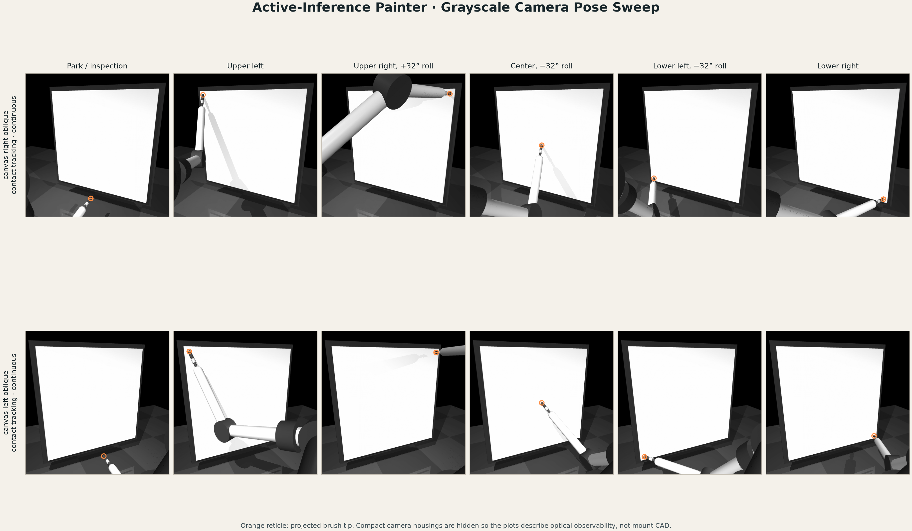
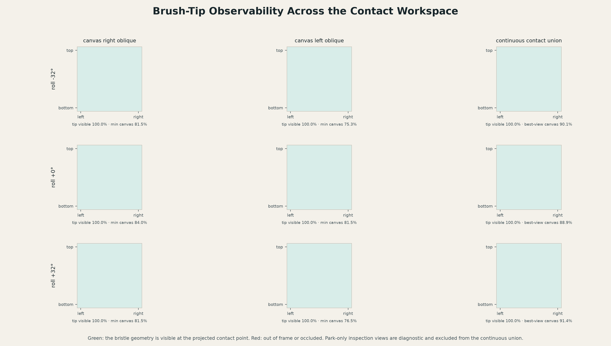

# Compact Dual-IMX296 Camera Observability Brief

**Rig:** `provisional-compact-dual-imx296-v1`

**Simulation model:** `mujoco-robstride-electromechanical-v4`

**Sweep:** 243 contact poses: a 9 x 9 canvas grid at upper-arm roll -32, 0,
and +32 degrees.

## Result

Two Raspberry Pi Global Shutter Cameras (Sony IMX296) are sufficient for the
current geometric brush/contact observation baseline. Each camera separately
keeps the projected bristle tip in frame and unoccluded in all 243 sampled
poses. The continuous pair therefore has 100% sampled union visibility.

Minimum sampled canvas visibility is 81.5% from the right view and 75.3% from
the left. Mean visibility is 93.8% and 94.2%, respectively. Occlusion of some
canvas rays by the arm is expected; the opposing view supplies redundancy.

*Representative model-input frames. The orange reticle is an analysis overlay
showing projected brush-tip position; it is not supplied to the agent.*

*Per-view sampled geometric visibility. These are not learned detector
probabilities.*

## Compact Geometry

The cameras share a rigid crossbar and aim at canvas center:

| View | World optical center (m) | Canvas-relative center | Incidence |
| --- | --- | --- | ---: |
| Right | `0.375 -0.1674 0.570` | right 300 mm, forward 650 mm, up 220 mm | 29.78 deg |
| Left | `-0.225 -0.1674 0.570` | left 300 mm, forward 650 mm, up 220 mm | 29.78 deg |

The centers span 600 mm and sit approximately 749 mm from canvas center. The
provisional camera bodies extend about 670 mm forward of the canvas plane and
about 640 mm across before allowance for crossbar ends, fasteners, cables, or
lights. This is a spatial envelope, not completed mounting CAD.

The previous full-size OM-1/A7R II pair and separate inspection/profile views
are not part of this baseline. Exactly two compact cameras are assumed.

## Observation Contract

| Property | Both views |
| --- | --- |
| Selected camera | Raspberry Pi Global Shutter Camera, Sony IMX296 |
| Hardware status | selected, not yet purchased |
| Native active array | 1456 x 1088, 3.45 micrometre pixels |
| Shutter / transport | global / CSI-2 |
| Provisional lens | 4 mm CS mount; exact SKU open |
| Nominal vertical field of view | 50.27 degrees |
| Provisional capture rate | 60 Hz |
| Global model input | 512 x 512 linear grayscale |
| Requested fovea | 256 x 256 |

The 4 mm focal length gives full-canvas framing in the ideal pinhole model.
Lens distortion, actual focus range, exposure, paired timing, and intrinsics
must be measured after purchase. The 60 Hz timing, 10-bit quantization, noise,
latency, and synchronization declarations are provisional simulation priors.
The smoke runtime may render 640 x 480 native frames for throughput while
preserving the sensor aspect ratio.

The model-facing likelihood remains
`registered_grayscale_occlusion_mixture_linearized_v0`. It consumes registered
grayscale evidence, predicts superficial tone from latent material state, and
infers inlier/occlusion responsibility from residuals. Exact MuJoCo
segmentation and visibility do not cross the inference boundary.

## What This Establishes—and What It Does Not

This sweep establishes only nominal geometric observability in MuJoCo:

- camera/mount visual geometry is excluded from sensor rays;
- MuJoCo grayscale lacks real paint photometry, glare, blur, distortion,
  exposure dynamics, and measured sensor noise;
- the tip test uses segmentation, not a trained image detector;
- no physical camera, lens, crossbar, or synchronization test has occurred.

The result supports building and learning with a compact two-view baseline. It
does not establish sensor-equivalent cognition, hardware calibration, contact
accuracy, or painting quality.

## Next Physical Gates

1. Purchase two camera modules and two matched 4 mm CS lenses.
2. Build an adjustable rigid crossbar at the declared nominal optical centers.
3. Measure intrinsics/distortion and canvas homographies for each camera.
4. Measure focus, exposure, frame timing, inter-camera skew, and dropped frames.
5. Capture arm/brush occlusion data throughout the workspace and train or
   validate the edge/tip observation model against real images.

The machine-readable evidence is in
`figures/camera_observability/camera_pose_sweep.json` and
`camera_pose_metrics.csv`; the plots are generated by
`python -m active_painter.camera_pose_sweep`.
