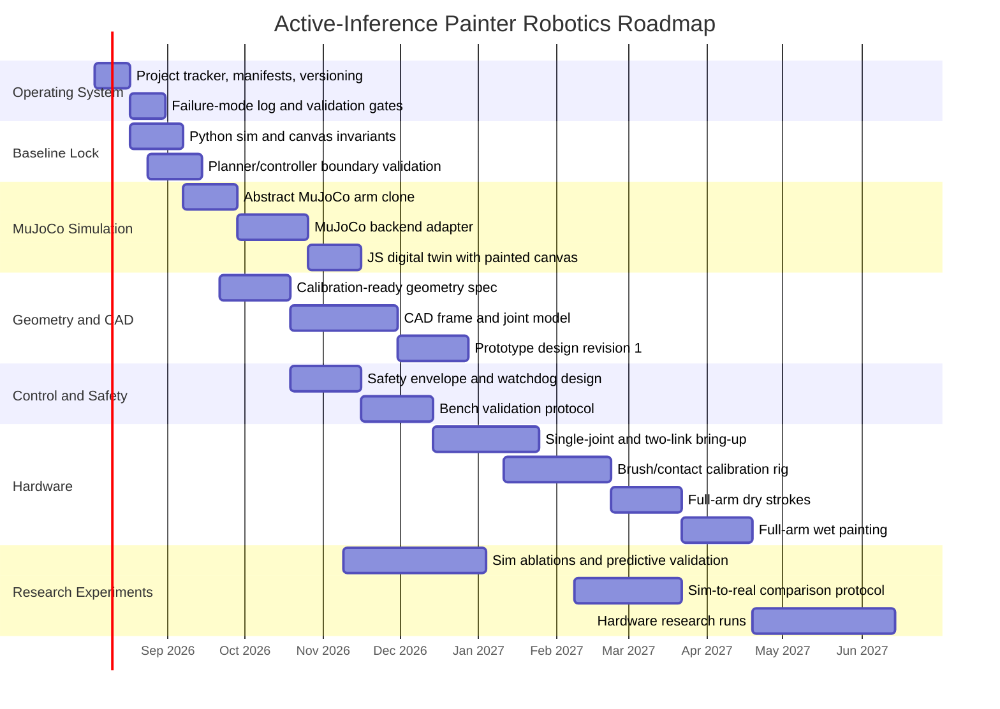

# Rough Gantt Chart

Assumption: schedule starts Monday, August 3, 2026. This is a rough planning
chart for a single-investigator pace. It should be revised after each milestone
gate.

## Phase Reading

- August-September 2026: organize the project and lock the current simulator baseline.
- September-November 2026: get MuJoCo to clone the current arm and drive the existing paint/controller loop.
- October-December 2026: define measured geometry, CAD conventions, and safety systems in parallel.
- December 2026-March 2027: hardware bring-up from single joint to wet painting.
- November 2026 onward: run research validation in simulation first, then compare against hardware.

## Dependency Rule

Do not let hardware/CAD detail block MuJoCo integration. The first MuJoCo target
is the abstract Python arm clone; calibrated physical geometry comes after
measurement.

