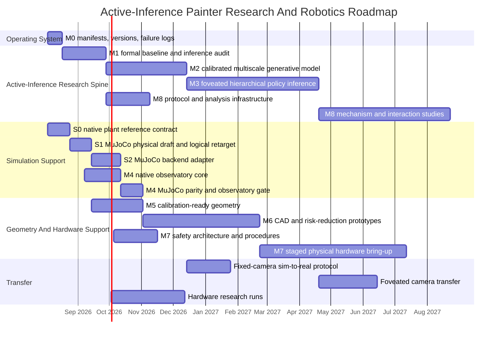

# Rough Gantt Chart

Assumption: schedule starts Monday, August 3, 2026. This is a planning envelope
for one investigator, not a staffing plan. Overlapping bars indicate work that
can be interleaved; they do not assume two full-time people. Dates must be
revised after each capability gate.

Status review updated 2026-08-26: the calendar envelope has not slipped—M1 was planned
as a six-week effort after M0—but implementation has run ahead into provisional
M2/S2/M5 branches while M1 scientific acceptance remains the critical path.
Those branches do not advance their milestone gates. AI-106 terminal/stopping
acceptance closed on 2026-08-11 with a required M2 forecast-family correction.
AI-108's 256-transition leakage-resistant corpus was accepted on 2026-08-11.
AI-107 then closed with a negative M2 calibration result. On 2026-08-12 the
27-run local branch of AI-109 found modest data sensitivity, no generic
capacity benefit, a negative result for the **material-posterior** cVAE, and
strong held-out density evidence for a normalized identity/consequence
likelihood. That mixture still fails exact predictive-mixture calibration; the
result does not test the owner's visual VAE proposal. A subsequent 192-step
pilot produced six genuine stops and two truncations, proving stop collection
is feasible, but it did not retain the registered image stream required by the
accepted visual hierarchy. The gate repair closes AI-109 for M1 on the
material-model evidence and closes AI-110 with the legacy composition
mechanisms disabled in `m1-formal-policy-baseline-v0`. AI-112 inheritance
closed on 2026-08-27 with checkpoint schema 7 and explicit individual/shared
load modes. AI-113 profiling and AI-114 replicas are now the M1 critical path. The
genuine-stop **visual** corpus, action-conditioned visual baseline, and
tone/edge/mass hierarchy are the M2 critical path. Dates should be rebased only after the M1 capability gate, not from
the amount of provisional implementation already present. The canonical
perceptual boundary is `docs/VISUAL_GENERATIVE_MODEL_BOUNDARY.md`; the gate
repair is `docs/M1_GATE_REPAIR_TECHNICAL_2026-08-26.md`. The inheritance
record is `docs/ONLINE_LEARNING_INHERITANCE_2026-08-27.md`.

```mermaid
gantt
    title Active-Inference Painter Research And Robotics Roadmap
    dateFormat  YYYY-MM-DD
    axisFormat  %b %Y

    section Operating System
    M0 manifests, versions, failure logs          :m0, 2026-08-03, 2w

    section Active-Inference Research Spine
    M1 formal baseline and inference audit        :m1, after m0, 6w
    M2 calibrated multiscale generative model     :m2, after m1, 11w
    M3 foveated hierarchical policy inference     :m3, after m2, 18w
    M8 protocol and analysis infrastructure       :m8a, after m1, 6w
    M8 mechanism and interaction studies          :m8b, after m3, 18w

    section Simulation Support
    S0 native plant reference contract            :s0, 2026-08-03, 3w
    S1 MuJoCo physical draft and logical retarget :s1, after s0, 3w
    S2 MuJoCo backend adapter                     :s2, after s1, 4w
    M4 native observatory core                    :m4a, 2026-09-07, 5w
    M4 MuJoCo parity and observatory gate         :m4b, after s2, 3w

    section Geometry And Hardware Support
    M5 calibration-ready geometry                 :m5, 2026-09-14, 7w
    M6 CAD and risk-reduction prototypes          :m6, after m5, 16w
    M7 safety architecture and procedures         :m7a, 2026-10-05, 6w
    M7 staged physical hardware bring-up          :m7b, after m6, 20w

    section Transfer
    Fixed-camera sim-to-real protocol             :r2, after m2, 6w
    Foveated camera transfer                      :r3, after m3, 8w
    Hardware research runs                        :r4, after m7, 10w
```

## Phase Reading

- August-September 2026: establish project operations and the native plant
  reference contract while completing the formal inference audit.
- September-December 2026: build and validate the sensor-equivalent multiscale
  generative model. MuJoCo support may be interleaved when it does not delay
  capability blockers.
- December 2026-April 2027: implement and test foveated hierarchical policy
  inference.
- September 2026 onward: progress geometry, CAD, safety architecture, and
  risk-reduction prototypes as their partial dependencies become available.
- After each capability gate: begin the corresponding M8 pilot or mechanism
  study; interaction studies wait for M3 single-mechanism results.

The previous schedule placed MuJoCo before unresolved inference validity and
was too optimistic for one investigator. The revised schedule makes research
gates primary and treats simulator/CAD work as bounded support.

## Dependency Rules

- M2 requires the M1 inference and calibration gate.
- M3 requires the M2 sensor-equivalent belief interface.
- M1 and S0 run concurrently; only plant-dependent M1 tasks wait on the
  specific S0 reference artifacts they consume.
- S1 requires the S0 native plant contract, not a permanent controller freeze.
- S2 requires the S1 coordinate and tip-site contract.
- M4 contract and native-view work may begin before S2; final cross-backend
  parity requires S2, not M3.
- M5 schema and preliminary mechanical work may proceed alongside M1-M3.
- M6 CAD begins from stable frames and operating envelopes, not from a final
  M5 design freeze.
- M7 safety architecture begins during M5/M6; powered stages wait on the exact
  prototype and safety artifacts they consume.
- M8 infrastructure begins after M1; each study waits on its own capability
  gate rather than all of M3.
- Hardware/CAD detail must not block the abstract MuJoCo clone.
- MuJoCo completion must not be treated as evidence that active inference is
  valid.
- No high-level negative result is interpreted until its lower capability
  gates pass.

## Budget Envelope

- M1 target compute: under USD 100.
- M2 target training compute: USD 100-250.
- M3 target incremental training compute: USD 250-400.
- M8 target paid confirmatory compute: no more than USD 200 without a new
  budget decision.
- Preserve at least USD 200 of the USD 1,000 model-training budget for failed
  runs, final replicas, and the optional pretrained comparison until an M8
  study plan explicitly allocates it.

These are ceilings for planning, not spending targets. Local or already-owned
compute should be used when it does not materially slow the research.
